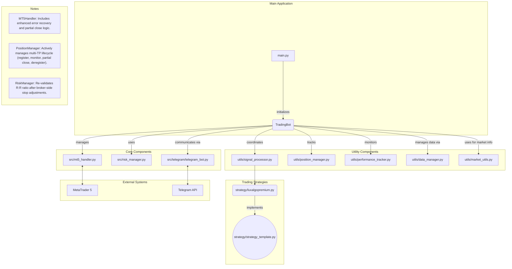

# Trading Bot

A sophisticated algorithmic trading system that integrates with MetaTrader 5 for automated Forex and synthetic indices trading.

## Table of Contents
- [Overview](#overview)
- [Key Features](#key-features)
- [System Architecture](#system-architecture)
- [Trading Strategies](#trading-strategies)
- [Risk Management](#risk-management)
- [Installation](#installation)
- [Configuration](#configuration)
- [Usage](#usage)
- [Telegram Integration](#telegram-integration)
- [Development](#development)
- [License](#license)

## Overview

This Trading Bot is a comprehensive algorithmic trading system designed to connect to MetaTrader 5, analyze market data using various technical indicators, generate trading signals, and execute trades based on predefined risk management rules. The system supports multiple trading strategies and timeframes while providing real-time feedback through Telegram notifications.

## Key Features

- **Multi-Strategy Support**: Implements various trading strategies including trend following, breakout trading, and price action-based approaches
- **Advanced Risk Management**: Sophisticated position sizing, drawdown controls, and account protection mechanisms
- **Real-Time Market Analysis**: Processes market data across multiple timeframes for enhanced decision-making
- **Telegram Integration**: Remote monitoring and control through Telegram messaging
- **Asynchronous Operation**: Efficiently handles multiple tasks simultaneously using asyncio
- **Detailed Logging**: Comprehensive logging system for debugging and performance analysis
- **Position Management**: Automated trailing stops and take-profit mechanisms
- **Performance Tracking**: Tracks and reports trading performance metrics
- **Advanced Error Handling**: Automatically handles common broker errors like invalid stops and unsupported order-filling modes.
- **Multi-Take-Profit Management**: Capable of managing trades with multiple take-profit levels, executing partial closes to secure profits incrementally.

## System Architecture

### Flow Chart



### Component Description

1.  **TradingBot (`trading_bot.py`)**: The central orchestrator that manages the entire trading process, initializes components, and handles the main event loops.

2.  **MT5Handler (`mt5_handler.py`)**: Manages the connection to MetaTrader 5, handles market data retrieval, and executes trading orders. It includes robust error handling to automatically adjust for broker-specific requirements (e.g., "invalid stops") and can execute **partial position closes**.

3.  **RiskManager (`risk_manager.py`)**: Handles position sizing, risk calculations, and implements trading limits. It performs a crucial final check, re-validating the risk-to-reward ratio *after* any automatic stop adjustments are made by the `MT5Handler` to ensure trade viability.

4.  **SignalProcessor (`src/utils/signal_processor.py`)**: Processes raw signals from strategies, applies risk management rules, and, upon successful execution, **registers the new trade with the `PositionManager`** for lifecycle management.

5.  **PositionManager (`src/utils/position_manager.py`)**: Monitors and manages all open positions. Its responsibilities include:
    - Managing standard trailing stops.
    - Tracking trades with multiple take-profit (TP) levels.
    - Continuously monitoring market price against each TP level.
    - Triggering partial closes via `MT5Handler` when a TP is hit.
    - Updating the trade's state (e.g., remaining volume, next TP).
    - Deregistering trades once they are fully closed.

6.  **DataManager (`src/utils/data_manager.py`)**: Handles market data caching and preprocessing for efficient strategy execution.

7.  **MarketUtils (`src/utils/market_utils.py`)**: Provides helper functions for market-specific data, such as symbol information, contract sizes, and minimum stop distances required by the broker.

8.  **TelegramBot (`src/telegram/telegram_bot.py`)**: Provides remote monitoring and control capabilities through Telegram messaging.

9.  **PerformanceTracker (`src/utils/performance_tracker.py`)**: Tracks and reports trading performance metrics.

## Trading Strategies

The system is designed to be modular, with strategies implementing a common template (`strategy_template.py`). The current primary strategy is:

1.  **PremiumLuxAlgoStrategy (`luxalgopremium.py`)**: An advanced strategy that uses signals from the LuxAlgo Premium indicator suite, generating signals with multiple take-profit levels for sophisticated trade management.

## Risk Management

The risk management system implements several layers of protection:

- **Position Sizing**: Calculates appropriate lot sizes based on account balance and risk percentage
- **Drawdown Protection**: Reduces position sizes or stops trading during drawdown periods
- **Trade Validation**: Validates all trades against risk parameters before execution. This includes a final risk-to-reward ratio check *after* the broker's minimum stop requirements have been met and applied.
- **Volatility Adjustment**: Adjusts position sizes based on market volatility
- **Recovery Mode**: Implements conservative trading during recovery from drawdowns
- **Daily/Weekly Limits**: Enforces limits on number of trades and maximum risk per day/week

## Installation

### Prerequisites
- Python 3.8 or higher
- MetaTrader 5 terminal installed
- Active MT5 account (demo or live)

### Setup

1. Clone the repository:
```bash
https://github.com/Ethansi2947E/Quant-Bot/tree/SuperTrend
cd Quant-Bot
```

2. Create a virtual environment:
```bash
python -m venv .venv
```

3. Activate the virtual environment:
```bash
# Windows
.venv\Scripts\activate
# Linux/Mac
source .venv/bin/activate
```

4. Install dependencies:
```bash
pip install -r requirements.txt
```

## Configuration

1. Create a `.env` file in the root directory with your MT5 and Telegram credentials:
```
MT5_SERVER=YourBrokerServerName
MT5_LOGIN=YourLoginNumber
MT5_PASSWORD=YourPassword
TELEGRAM_BOT_TOKEN=YourTelegramBotToken
TELEGRAM_ALLOWED_USERS=YourTelegramUserID
```

2. Configure trading parameters in `config/config.py`:
   - Symbols to trade
   - Risk parameters
   - Strategy-specific settings
   - Telegram settings

## Usage

### Starting the Bot

Run the bot using:
```bash
python main.py
```

For Windows users, you can use the provided batch file:
```bash
run_bot.bat
```

### Telegram Commands

Once the bot is running, you can control it via Telegram with the following commands:

**General & Status**
- `/status` - Get a detailed overview of the bot's current status, including trading state, open positions, and account balance.
- `/statustable` - View a concise, table-formatted summary of open positions.
- `/performance` - Receive a comprehensive performance report with key trading metrics.
- `/balance` - Get the current account balance, equity, and margin information.
- `/metrics` - Display detailed trading metrics, such as win rate, profit factor, and drawdown.
- `/history {days}` - Show the trade history for the last specified number of days (e.g., `/history 7`).
- `/daily` - Get a summary of the current day's trading activity and P/L.
- `/count` - Show the number of trades taken today, this week, and this month.

**Trading Control**
- `/enable` - Enable the trading functionality. The bot will start processing signals and opening trades.
- `/disable` - Disable trading. The bot will stop opening new trades but continue to manage existing ones.
- `/listsignalgenerators` - List all available signal generation strategies.
- `/setsignalgenerator {generator_name}` - Switch the active signal generation strategy.

**Risk & Position Management**
- `/enabletrailingstop` - Enable the automated trailing stop loss for managed positions.
- `/disabletrailingstop` - Disable the trailing stop loss.
- `/enablepositionadditions` - Allow the bot to add to existing positions (pyramiding).
- `/disablepositionadditions` - Prevent the bot from adding to existing positions.

**Admin & Shutdown**
- `/enablecloseonshutdown` - Configure the bot to automatically close all open positions upon shutdown.
- `/disablecloseonshutdown` - Prevent the bot from closing positions upon shutdown.
- `/shutdown` - Safely shut down the bot.

## Telegram Integration

The bot supports remote monitoring and control through Telegram:

1. Create a Telegram bot using BotFather and obtain the API token
2. Add the token to your `.env` file
3. Add your Telegram user ID to the allowed users list
4. Communicate with your bot through the Telegram app

## Development

### Project Structure

```
Trading_Bot/
├── config/                   # Configuration files
│   ├── __init__.py
│   └── config.py            # Main configuration
├── src/                      # Source code
│   ├── mt5_handler.py       # MetaTrader 5 interface
│   ├── trading_bot.py       # Main bot orchestrator
│   ├── risk_manager.py      # Risk management
│   ├── strategy/            # Trading strategies
│   │   ├── __init__.py
│   │   ├── luxalgopremium.py    # LuxAlgo Premium signal strategy
│   │   └── strategy_template.py # Base template for new strategies
│   ├── telegram/            # Telegram integration
│   │   ├── telegram_bot.py
│   │   └── telegram_command_handler.py
│   ├── utils/               # Utility functions
│   │   ├── __init__.py
│   │   ├── data_manager.py
│   │   ├── market_utils.py
│   │   ├── performance_tracker.py
│   │   ├── position_manager.py
│   │   └── signal_processor.py
├── exports/                 # Exported data and reports
├── main.py                  # Entry point
├── requirements.txt         # Package dependencies
├── run_bot.bat              # Windows startup script
└── README.md                # This file
```

### Extending the Bot

#### Adding a New Strategy

1. Create a new strategy file in the `src/strategy/` directory
2. Extend the `SignalGenerator` class
3. Implement the `generate_signals()` method
4. Add the strategy to the list in `config.py`

#### Custom Risk Management

Modify the `RiskManager` class in `src/risk_manager.py` to implement custom risk management rules.

## License

This project is licensed under the MIT License. 
