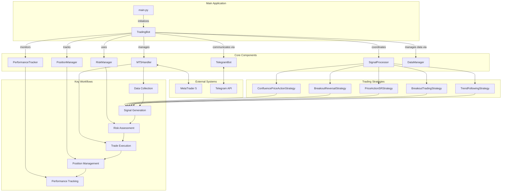

# Trading Bot

A sophisticated algorithmic trading system that integrates with MetaTrader 5 for automated Forex and synthetic indices trading.

## Table of Contents
- [Overview](#overview)
- [Key Features](#key-features)
- [System Architecture](#system-architecture)
- [Trading Strategies](#trading-strategies)
- [Risk Management](#risk-management)
- [Installation](#installation)
- [Configuration](#configuration)
- [Usage](#usage)
- [Telegram Integration](#telegram-integration)
- [Development](#development)
- [License](#license)

## Overview

This Trading Bot is a comprehensive algorithmic trading system designed to connect to MetaTrader 5, analyze market data using various technical indicators, generate trading signals, and execute trades based on predefined risk management rules. The system supports multiple trading strategies and timeframes while providing real-time feedback through Telegram notifications.

## Key Features

- **Multi-Strategy Support**: Implements various trading strategies including trend following, breakout trading, and price action-based approaches
- **Advanced Risk Management**: Sophisticated position sizing, drawdown controls, and account protection mechanisms
- **Real-Time Market Analysis**: Processes market data across multiple timeframes for enhanced decision-making
- **Telegram Integration**: Remote monitoring and control through Telegram messaging
- **Asynchronous Operation**: Efficiently handles multiple tasks simultaneously using asyncio
- **Detailed Logging**: Comprehensive logging system for debugging and performance analysis
- **Position Management**: Automated trailing stops and take-profit mechanisms
- **Performance Tracking**: Tracks and reports trading performance metrics

## System Architecture

### Flow Chart



### Component Description

1. **TradingBot (trading_bot.py)**: The central orchestrator that manages the entire trading process, initializes components, and handles the main event loops.

2. **MT5Handler (mt5_handler.py)**: Manages the connection to MetaTrader 5, handles market data retrieval, and executes trading orders.

3. **RiskManager (risk_manager.py)**: Handles position sizing, risk calculations, and implements trading limits to protect account equity.

4. **SignalProcessor**: Processes raw signals from strategies and applies risk management rules before execution.

5. **PositionManager**: Monitors and manages open positions, including trailing stops and take-profit orders.

6. **DataManager**: Handles market data caching and preprocessing for efficient strategy execution.

7. **TelegramBot**: Provides remote monitoring and control capabilities through Telegram messaging.

8. **PerformanceTracker**: Tracks and reports trading performance metrics.

## Trading Strategies

The system implements multiple trading strategies:

1. **Trend Following Strategy**: Identifies established trends using ADX and moving averages, entering on pullbacks to dynamic support/resistance levels.

2. **Breakout Trading Strategy**: Detects price breakouts from consolidation patterns or key levels with confirmation filters.

3. **Price Action SR Strategy**: Uses support and resistance levels combined with price action patterns for entries.

4. **Breakout Reversal Strategy**: Identifies false breakouts and potential trend reversals.

5. **Confluence Price Action Strategy**: Combines multiple technical factors to identify high-probability setups.

## Risk Management

The risk management system implements several layers of protection:

- **Position Sizing**: Calculates appropriate lot sizes based on account balance and risk percentage
- **Drawdown Protection**: Reduces position sizes or stops trading during drawdown periods
- **Trade Validation**: Validates all trades against risk parameters before execution
- **Volatility Adjustment**: Adjusts position sizes based on market volatility
- **Recovery Mode**: Implements conservative trading during recovery from drawdowns
- **Daily/Weekly Limits**: Enforces limits on number of trades and maximum risk per day/week

## Installation

### Prerequisites
- Python 3.8 or higher
- MetaTrader 5 terminal installed
- Active MT5 account (demo or live)

### Setup

1. Clone the repository:
```bash
git clone https://github.com/yourusername/trading_bot.git
cd Trading_Bot
```

2. Create a virtual environment:
```bash
python -m venv .venv
```

3. Activate the virtual environment:
```bash
# Windows
.venv\Scripts\activate
# Linux/Mac
source .venv/bin/activate
```

4. Install dependencies:
```bash
pip install -r requirements.txt
```

## Configuration

1. Create a `.env` file in the root directory with your MT5 and Telegram credentials:
```
MT5_SERVER=YourBrokerServerName
MT5_LOGIN=YourLoginNumber
MT5_PASSWORD=YourPassword
TELEGRAM_BOT_TOKEN=YourTelegramBotToken
TELEGRAM_ALLOWED_USERS=YourTelegramUserID
```

2. Configure trading parameters in `config/config.py`:
   - Symbols to trade
   - Risk parameters
   - Strategy-specific settings
   - Telegram settings

## Usage

### Starting the Bot

Run the bot using:
```bash
python main.py
```

For Windows users, you can use the provided batch file:
```bash
run_bot.bat
```

### Telegram Commands

Once the bot is running, you can control it via Telegram with the following commands:

- `/status` - Check the current status of the bot
- `/enable_trading` - Enable trading
- `/disable_trading` - Disable trading
- `/list_signals` - List recent trading signals
- `/list_positions` - List current open positions
- `/close_position {ticket}` - Close a specific position
- `/close_all` - Close all open positions
- `/shutdown` - Safely shut down the bot

## Telegram Integration

The bot supports remote monitoring and control through Telegram:

1. Create a Telegram bot using BotFather and obtain the API token
2. Add the token to your `.env` file
3. Add your Telegram user ID to the allowed users list
4. Communicate with your bot through the Telegram app

## Development

### Project Structure

```
Trading_Bot/
├── config/                   # Configuration files
│   ├── __init__.py
│   └── config.py            # Main configuration
├── src/                      # Source code
│   ├── mt5_handler.py       # MetaTrader 5 interface
│   ├── trading_bot.py       # Main bot orchestrator
│   ├── risk_manager.py      # Risk management
│   ├── strategy/            # Trading strategies
│   │   ├── __init__.py
│   │   ├── trend_following_strategy.py
│   │   ├── breakout_trading_strategy.py
│   │   ├── price_action_sr_strategy.py
│   │   └── ...
│   ├── telegram/            # Telegram integration
│   │   ├── telegram_bot.py
│   │   └── telegram_command_handler.py
│   ├── utils/               # Utility functions
│   │   ├── indicators.py
│   │   ├── position_manager.py
│   │   ├── signal_processor.py
│   │   ├── data_manager.py
│   │   └── performance_tracker.py
│   └── backtest/            # Backtesting framework
├── exports/                 # Exported data and reports
├── main.py                  # Entry point
├── requirements.txt         # Package dependencies
├── run_bot.bat              # Windows startup script
└── README.md                # This file
```

### Extending the Bot

#### Adding a New Strategy

1. Create a new strategy file in the `src/strategy/` directory
2. Extend the `SignalGenerator` class
3. Implement the `generate_signals()` method
4. Add the strategy to the list in `config.py`

#### Custom Risk Management

Modify the `RiskManager` class in `src/risk_manager.py` to implement custom risk management rules.

## License

This project is licensed under the MIT License. 