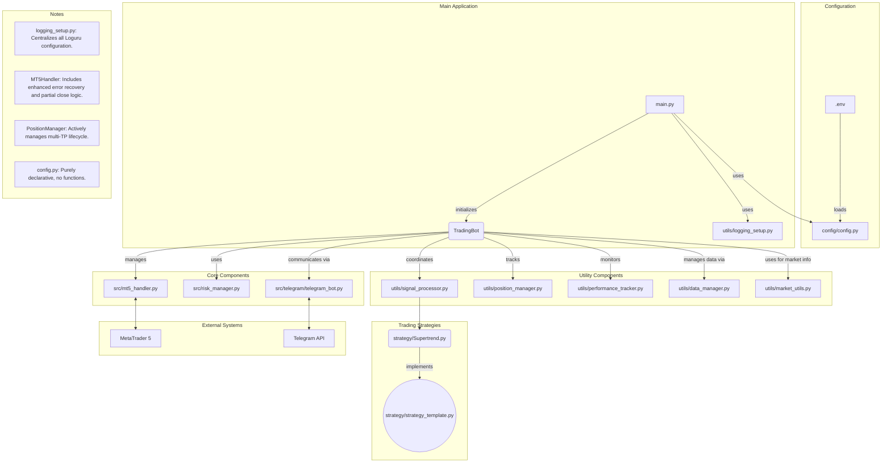

<div align="center">
  
</div>

# 🤖 Quant Bot

A sophisticated algorithmic trading system that integrates with MetaTrader 5 for automated Forex and synthetic indices trading.

## Table of Contents
- [Overview](#overview)
- [✨ Key Features](#-key-features)
- [🏗️ System Architecture](#-system-architecture)
- [📈 Trading Strategies](#-trading-strategies)
- [🛡️ Risk Management](#-risk-management)
- [🚀 Installation](#-installation)
- [⚙️ Configuration](#-configuration)
- [▶️ Usage](#-usage)
- [💬 Telegram Integration](#-telegram-integration)
- [💻 Development](#-development)
- [📜 License](#-license)

## Overview

This Trading Bot is a comprehensive algorithmic trading system designed to connect to MetaTrader 5, analyze market data using various technical indicators, generate trading signals, and execute trades based on predefined risk management rules. The system supports multiple trading strategies and timeframes while providing real-time feedback through Telegram notifications.

## ✨ Key Features

- **🧠 Multi-Strategy Support**: Implements various trading strategies including trend following, breakout trading, and price action-based approaches.
- **🛡️ Advanced Risk Management**: Sophisticated position sizing, drawdown controls, and account protection mechanisms.
- **📈 Real-Time Market Analysis**: Processes market data across multiple timeframes for enhanced decision-making.
- **💬 Telegram Integration**: Remote monitoring and control through Telegram messaging.
- **⚡ Asynchronous Operation**: Efficiently handles multiple tasks simultaneously using asyncio.
- **📝 Detailed Logging**: Comprehensive logging system for debugging and performance analysis.
- **📊 Position Management**: Automated trailing stops and take-profit mechanisms.
- **📉 Performance Tracking**: Tracks and reports trading performance metrics.
- **🔧 Advanced Error Handling**: Automatically handles common broker errors like invalid stops and unsupported order-filling modes.
- **🎯 Multi-Take-Profit Management**: Capable of managing trades with multiple take-profit levels, executing partial closes to secure profits incrementally.

## 📊 Quant-Dash Dashboard

This project includes a powerful web-based dashboard built with Next.js and Tailwind CSS for real-time monitoring and analytics.

- **Visualize Performance**: Track your bot's performance with interactive charts and detailed metrics.
- **Monitor Live Trades**: Keep an eye on all active trades in a clean, user-friendly interface.
- **Review History**: Analyze historical trade data to refine your strategies.

The dashboard runs separately and connects to the bot's API. For setup instructions and more details, please see the [Quant-Dash README](./Quant-Dash/README.md).

The public repository for the dashboard can be found here: [https://github.com/Ethansi2947E/Quant-Dash](https://github.com/Ethansi2947E/Quant-Dash)

## 🏗️ System Architecture

### Flow Chart



### Component Description

1.  **`main.py`**: The application's entry point. It loads the environment, uses `logging_setup.py` to configure the global logger, reads the declarative configs from `config.py`, and initializes and runs the `TradingBot`.

2.  **`config/config.py`**: A purely declarative file containing all static configurations for the bot (MT5, Trading, Telegram, Risk). It contains **no functions** and is the single source of truth for all parameters.

3.  **`utils/logging_setup.py`**: A dedicated utility that handles all logging configuration. It sets up `Loguru`, intercepts the standard Python logger, and configures console and file outputs based on settings in `config.py`.

4.  **TradingBot (`trading_bot.py`)**: The central orchestrator that manages the entire trading process, initializes components, and handles the main event loops.

5.  **MT5Handler (`mt5_handler.py`)**: Manages the connection to MetaTrader 5, handles market data retrieval, and executes trading orders. It includes robust error handling to automatically adjust for broker-specific requirements (e.g., "invalid stops") and can execute **partial position closes**.

6.  **RiskManager (`risk_manager.py`)**: Handles position sizing, risk calculations, and implements trading limits. It performs a crucial final check, re-validating the risk-to-reward ratio *after* any automatic stop adjustments are made by the `MT5Handler` to ensure trade viability.

7.  **SignalProcessor (`src/utils/signal_processor.py`)**: Processes raw signals from strategies, applies risk management rules, and, upon successful execution, **registers the new trade with the `PositionManager`** for lifecycle management.

5.  **PositionManager (`src/utils/position_manager.py`)**: Monitors and manages all open positions. Its responsibilities include:
    - Managing standard trailing stops.
    - Tracking trades with multiple take-profit (TP) levels.
    - Continuously monitoring market price against each TP level.
    - Triggering partial closes via `MT5Handler` when a TP is hit.
    - Updating the trade's state (e.g., remaining volume, next TP).
    - Deregistering trades once they are fully closed.

9.  **DataManager (`src/utils/data_manager.py`)**: Handles market data caching and preprocessing for efficient strategy execution.

10. **MarketUtils (`src/utils/market_utils.py`)**: Provides helper functions for market-specific data, such as symbol information and contract sizes.

11. **TelegramBot (`src/telegram/telegram_bot.py`)**: Provides remote monitoring and control capabilities through Telegram messaging.

12. **PerformanceTracker (`src/utils/performance_tracker.py`)**: Tracks and reports trading performance metrics.

## Trading Strategies

The system is designed to be modular, with strategies implementing a common template (`strategy_template.py`). The current primary strategy is:

1.  **SuperTrendStrategy (`Supertrend.py`)**: A strategy centered around the Supertrend indicator, using a collection of other indicators for confirmation. It generates signals with multiple take-profit levels for sophisticated trade management.

## Risk Management

The risk management system implements several layers of protection:

- **Position Sizing**: Calculates appropriate lot sizes based on account balance and risk percentage
- **Drawdown Protection**: Reduces position sizes or stops trading during drawdown periods
- **Trade Validation**: Validates all trades against risk parameters before execution. This includes a final risk-to-reward ratio check *after* the broker's minimum stop requirements have been met and applied.
- **Volatility Adjustment**: Adjusts position sizes based on market volatility
- **Recovery Mode**: Implements conservative trading during recovery from drawdowns
- **Daily/Weekly Limits**: Enforces limits on number of trades and maximum risk per day/week

## 🚀 Installation

### Prerequisites
- MetaTrader 5 terminal installed
- An active MT5 account (demo or live)
- A Telegram Bot token and your User ID (see [Telegram Integration](#telegram-integration))

### Automated Installation

#### 🏁 For Windows Users
The setup process is fully automated. Simply run the installer script:

1.  **Run the Installer**: Double-click the `install_windows.bat` file.
2.  **Follow the Prompts**: The script will guide you through creating a virtual environment and installing all necessary dependencies, including the tricky `TA-Lib` library.

#### 🐧 For Linux & macOS Users
A similar automated script is provided:

1.  **Make the Script Executable**:
    ```bash
    chmod +x install_linux.sh
    ```
2.  **Run the Installer**:
    ```bash
    ./install_linux.sh
    ```
3.  **Follow the Prompts**: The script will guide you through installing `TA-Lib` and all other dependencies. You may be prompted for your password for system-level packages.

### 🔄 Updating the Bot

To update your bot to the latest version, simply run the `update.sh` script. This script will automatically download the latest code, rebuild the Docker image, and restart the bot for you.

```bash
# On Linux/macOS or Windows (using Git Bash)
./update.sh
```

## ⚙️ Configuration

1. Create a `.env` file in the root directory with your MT5 and Telegram credentials:
```
MT5_SERVER=YourBrokerServerName
MT5_LOGIN=YourLoginNumber
MT5_PASSWORD=YourPassword
TELEGRAM_BOT_TOKEN=YourTelegramBotToken
TELEGRAM_ALLOWED_USERS=YourTelegramUserID
```

2. Configure trading parameters in `config/config.py`:
   - Symbols to trade
   - Risk parameters
   - Strategy-specific settings
   - Telegram settings

## ▶️ Usage

### Starting the Bot

Run the bot using:
```bash
python main.py
```

For Windows users, you can use the provided batch file:
```bash
run_bot.bat
```

### Telegram Commands

Once the bot is running, you can control it via Telegram with the following commands:

**📊 General & Status**
- `/status` - Get a detailed overview of the bot's current status, including trading state, open positions, and account balance.
- `/statustable` - View a concise, table-formatted summary of open positions.
- `/performance` - Receive a comprehensive performance report with key trading metrics.
- `/balance` - Get the current account balance, equity, and margin information.
- `/metrics` - Display detailed trading metrics, such as win rate, profit factor, and drawdown.
- `/history {days}` - Show the trade history for the last specified number of days (e.g., `/history 7`).
- `/daily` - Get a summary of the current day's trading activity and P/L.
- `/count` - Show the number of trades taken today, this week, and this month.

**🕹️ Trading Control**
- `/enable` - Enable the trading functionality. The bot will start processing signals and opening trades.
- `/disable` - Disable trading. The bot will stop opening new trades but continue to manage existing ones.
- `/listsignalgenerators` - List all available signal generation strategies.
- `/setsignalgenerator {generator_name}` - Switch the active signal generation strategy.

**🛡️ Risk & Position Management**
- `/enabletrailingstop` - Enable the automated trailing stop loss for managed positions.
- `/disabletrailingstop` - Disable the trailing stop loss.
- `/enablepositionadditions` - Allow the bot to add to existing positions (pyramiding).
- `/disablepositionadditions` - Prevent the bot from adding to existing positions.

**⚙️ Admin & Shutdown**
- `/enablecloseonshutdown` - Configure the bot to automatically close all open positions upon shutdown.
- `/disablecloseonshutdown` - Prevent the bot from closing positions upon shutdown.
- `/shutdown` - Safely shut down the bot.

## 💬 Telegram Integration

The bot uses Telegram for remote monitoring and control. To set it up, you need a bot token and your personal user ID.

### Step 1: Create a Bot with BotFather

1.  **Find BotFather**: Open your Telegram app and search for the official `@BotFather` bot (it has a blue checkmark).
2.  **Start a New Bot**: Send the `/newbot` command to BotFather.
3.  **Name Your Bot**: Follow the prompts to give your bot a user-friendly name (e.g., "My Trading Assistant").
4.  **Set a Username**: Choose a unique username for your bot, which must end in "bot" (e.g., `MyTradingAssistantBot`).
5.  **Save Your Token**: BotFather will provide you with an **API Token**. This is a secret key required for the bot to function. Copy it immediately and keep it safe. You will need it for the `.env` file.

### Step 2: Find Your Telegram User ID

To ensure only you can control the bot, you must provide your unique Telegram User ID.

1.  **Find UserInfo Bot**: In Telegram, search for a bot like `@userinfobot`.
2.  **Get Your ID**: Start a chat with the bot and it will immediately reply with your User ID (it's a long number).
3.  **Save Your ID**: Copy this ID. You will need it for the `.env` file.

### Step 3: Configure the Bot

1.  Add the **API Token** and **User ID** you just obtained to your `.env` file:
    ```
    TELEGRAM_BOT_TOKEN=YourAPITokenFromBotFather
    TELEGRAM_ALLOWED_USERS=YourUserIDFromUserInfoBot
    ```
2.  Start the trading bot. You can now communicate with it from your Telegram account.

## 📂 Project Structure
```
Trading_Bot/
├── config/                   # Configuration files
│   ├── __init__.py
│   └── config.py            # Main configuration (declarative only)
├── src/                      # Source code
│   ├── mt5_handler.py       # MetaTrader 5 interface
│   ├── trading_bot.py       # Main bot orchestrator
│   ├── risk_manager.py      # Risk management
│   ├── strategy/            # Trading strategies
│   │   ├── __init__.py
│   │   ├── Supertrend.py        # Supertrend-based signal strategy
│   │   └── strategy_template.py # Base template for new strategies
│   ├── telegram/            # Telegram integration
│   │   ├── telegram_bot.py
│   │   └── telegram_command_handler.py
│   ├── utils/               # Utility functions
│   │   ├── __init__.py
│   │   ├── data_manager.py
│   │   ├── logging_setup.py   # Centralized logging configuration
│   │   ├── market_utils.py
│   │   ├── performance_tracker.py
│   │   ├── position_manager.py
│   │   └── signal_processor.py
├── exports/                 # Exported data and reports
├── main.py                  # Entry point
├── requirements.txt         # Package dependencies
├── run_bot.bat              # Windows startup script
├── install_windows.bat      # Windows automated installer
├── install_linux.sh         # Linux/macOS automated installer
├── update.sh                # Universal update script
├── Dockerfile               # Instructions to build the Docker image
├── docker-compose.yml       # Docker Compose configuration
├── .dockerignore            # Files to exclude from the Docker image
└── README.md                # This file
```

## 💻 Development

### Extending the Bot

#### Adding a New Strategy

1. Create a new strategy file in the `src/strategy/` directory
2. Extend the `SignalGenerator` class
3. Implement the `generate_signals()` method
4. Add the strategy to the list in `config.py`

#### Custom Risk Management

Modify the `RiskManager` class in `src/risk_manager.py` to implement custom risk management rules.

## 📜 License

This project is licensed under the MIT License. 

